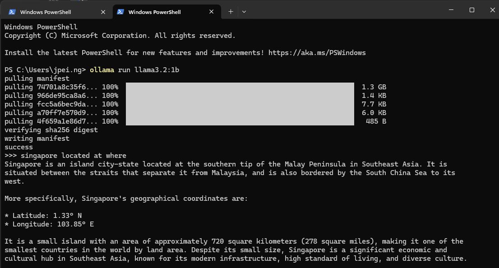

# IT5007_2420 HandsOn

# Agenda

1. Introduction
2. Setting Up and Testing Ollama Locally
3. Hands-on Workshop: Building a Multimodal Application (Chatbot & Vison tool)

## Getting started

### Prerequisite

Before proceeding with the installation, ensure you have the following installed:

1. JavaScript
2. npm
3. Ollama

### Installing for Ollama

To install Ollama, follow these steps:

Visit the official website: Ollama Downloads

Download the appropriate version for your operating system.


Installation Steps
The images below demonstrate the step-by-step installation process.

If the installation is successful, your output should resemble the final image.

**Step 1**


**Step 2**


**Step 3**


**Step 4**


### Setup for application

Follow the steps below to set up and run the application.

1. Start the Frontend

Run the following commands in your terminal:

```
cd {root_dir}/frontend/
npm install   # Install dependencies
npm run start # Start the frontend development server
```

2. Start the Backend

In a new terminal window, navigate to the backend directory and start the server:

```
cd {root_dir}/backend/
npm install   # Install dependencies
npm run start # Start the backend server
```

> [!NOTE]
> You only need to run _npm install_ once during setup. Next time, you can start the application by running _npm run start_ in both the frontend and backend directories.

